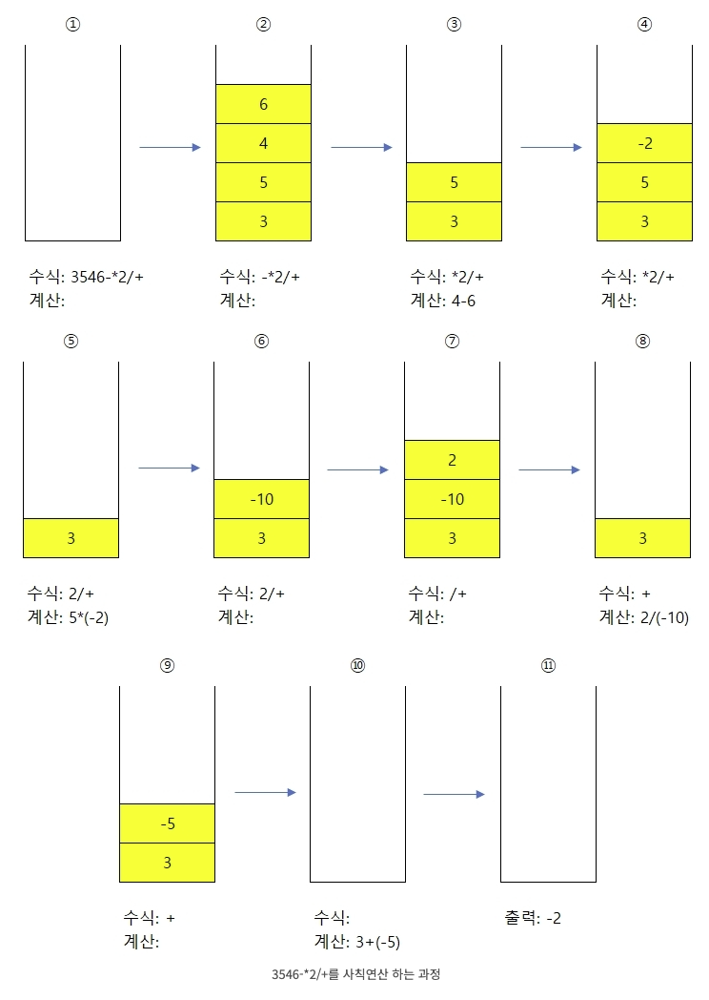

# 문제 (실버3)

후위 표기식과 각 피연산자에 대응하는 값들이 주어져 있을 때, 그 식을 계산하는 프로그램을 작성하시오.

[https://www.acmicpc.net/problem/1935](https://www.acmicpc.net/problem/1935)

# 입력 

첫째 줄에 피연산자의 개수(1 ≤ N ≤ 26) 가 주어진다. 그리고 둘째 줄에는 후위 표기식이 주어진다. (여기서 피연산자는 A~Z의 영대문자이며, A부터 순서대로 N개의 영대문자만이 사용되며, 길이는 100을 넘지 않는다) 그리고 셋째 줄부터 N+2번째 줄까지는 각 피연산자에 대응하는 값이 주어진다. 3번째 줄에는 A에 해당하는 값, 4번째 줄에는 B에 해당하는값 , 5번째 줄에는 C ...이 주어진다, 그리고 피연산자에 대응 하는 값은 100보다 작거나 같은 자연수이다.

후위 표기식을 앞에서부터 계산했을 때, 식의 결과와 중간 결과가 -20억보다 크거나 같고, 20억보다 작거나 같은 입력만 주어진다.

# 출력

계산 결과를 소숫점 둘째 자리까지 출력한다.

```
5
ABC*+DE/-
1
2
3
4
5
```

```
6.20
```

```
1
AA+A+
1
```

```
3.00
```

# 후위표현식 계산 방법

[규칙]

1. 숫자는 스택에 그냥 추가한다.
2. 연산자가 나오면 숫자 2개를 pop 해서 계산한다.
3. 이때 먼저 pop 되는 숫자가 두 번째 값, 나중에 pop되는 숫자가 첫 번째 값으로 하여 계산해야 한다. 계산한 값은 다시 스택에 넣는다.



① 3546-*2/+이라는 후위 표기식이 준비되었다.
② [규칙 1]에 의해 숫자들을 차례대로 스택에 넣는다.
③ [규칙 2]에 의해 숫자 2개를 pop 한다. 이때 [규칙 3]에 의해 먼저 pop 된 '6'이 두 번째 값으로 나중에 pop된 '4'는 첫 번째 값으로 두어 계산한다. 즉, 4-6을 계산한다.
④ 계산한 값을 다시 스택에 넣는다.
⑤ [규칙 2], [규칙 3]에 의해 계산한다.
⑥ 계산한 값을 다시 스택에 넣는다.
⑦ [규칙 1]에 의해 '2'는 숫자니까 스택에 넣는다.
⑧ [규칙 2], [규칙 3]에 의해 계산한다.
⑨ 계산한 값을 다시 스택에 넣는다.
⑩ [규칙 2], [규칙 3]에 의해 계산한다.
⑪ 모든 수식이 끝나면 스택에 계산 결과만이 남게 된다. 이를 출력하면 끝

# 풀이

1. 숫자는 피연산자가 나오기 전까지 stack 안에 순서대로 값을 담는다.

# 참고한 사이트

[https://wikidocs.net/192124](https://wikidocs.net/192124)
[https://todaycode.tistory.com/73](https://todaycode.tistory.com/73)