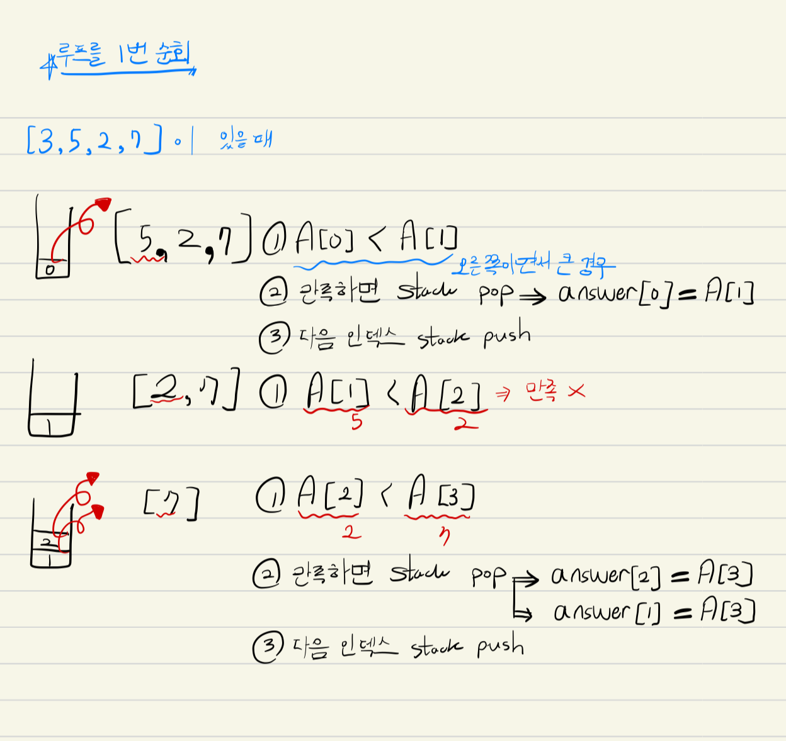

# 문제 (골드4)

크기가 N인 수열 A = A1, A2, ..., AN이 있다. 수열의 각 원소 Ai에 대해서 오큰수 NGE(i)를 구하려고 한다. **Ai의 오큰수는 오른쪽에 있으면서 Ai보다 큰 수 중에서 가장 왼쪽에 있는 수**를 의미한다. 그러한 수가 없는 경우에 오큰수는 -1이다.

예를 들어, A = [3, 5, 2, 7]인 경우 NGE(1) = 5, NGE(2) = 7, NGE(3) = 7, NGE(4) = -1이다. A = [9, 5, 4, 8]인 경우에는 NGE(1) = -1, NGE(2) = 8, NGE(3) = 8, NGE(4) = -1이다.

[https://www.acmicpc.net/problem/17298](https://www.acmicpc.net/problem/17298)

# 입력

첫째 줄에 수열 A의 크기 N (1 ≤ N ≤ 1,000,000)이 주어진다. 둘째 줄에 수열 A의 원소 A1, A2, ..., AN (1 ≤ Ai ≤ 1,000,000)이 주어진다. 

# 출력

총 N개의 수 NGE(1), NGE(2), ..., NGE(N)을 공백으로 구분해 출력한다. 

```
4
3 5 2 7
```

```
5 7 7 -1
```

# 풀이과정

1. stack에 첫번째 인덱스를 담는다. 
2. 리스트를 순회하며, 인접한 두 원소끼리 값을 비교한다. 
3. 인접한 두 원소 중 오른쪽이 클 때, stack을 pop하여 answer를 업데이트한다. 
4. 그 이후에 stack의 가장위에 있는 값이 현재 오른쪽 값보다 작은 지 확인하고, 작다면 pop 한다. 
5. stack이 비거나 왼쪽의 값이 더 큰 값을 가질때 까지 3번을 반복한다. 

