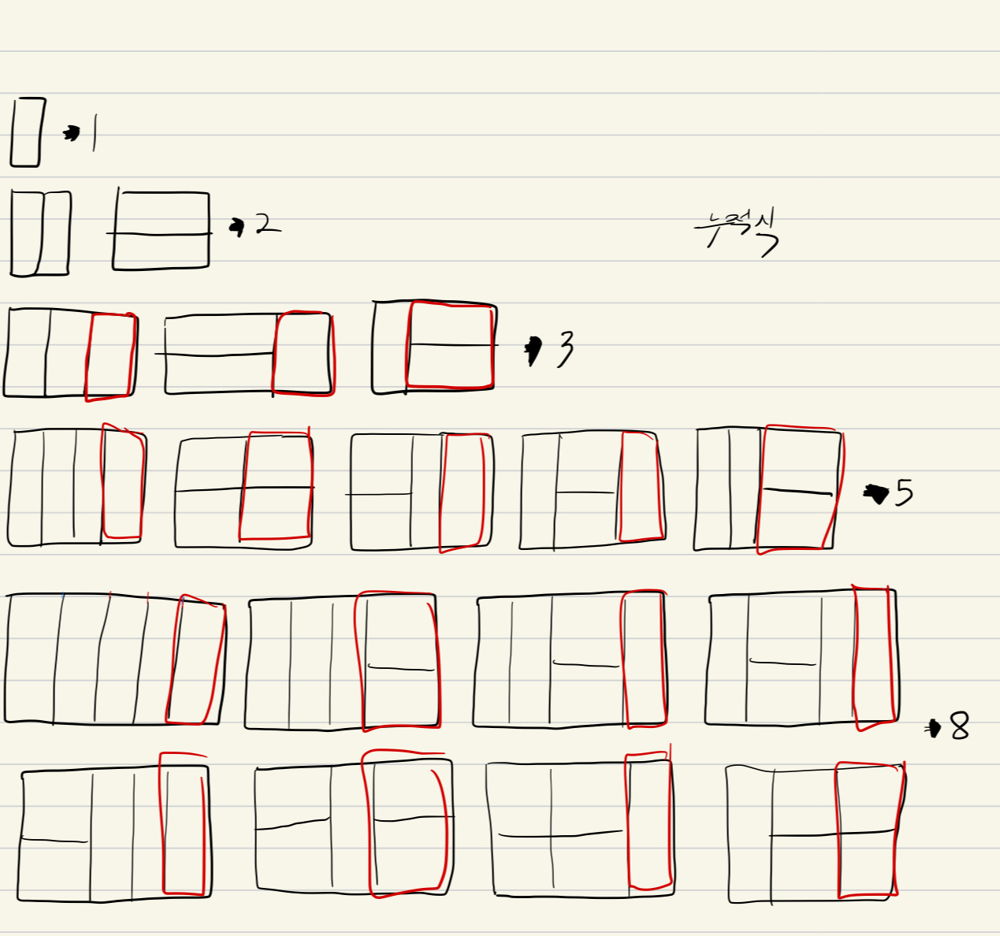

# 문제

[링크](https://www.acmicpc.net/problem/11726)

# 해설

- 2 x 3 직사각형을 채우기 위해서 , 2 x 2 직사각형의 가장 오른쪽에 2 x 1 타일을 추가한 것
- 2 x 3 직사각형을 채우기 위해서 , 1 x 2 짜리 타일을 2개 추가한 것

[링크](https://yabmoons.tistory.com/506)
