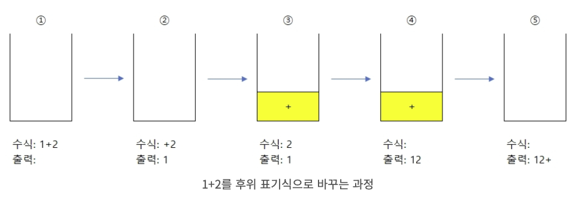
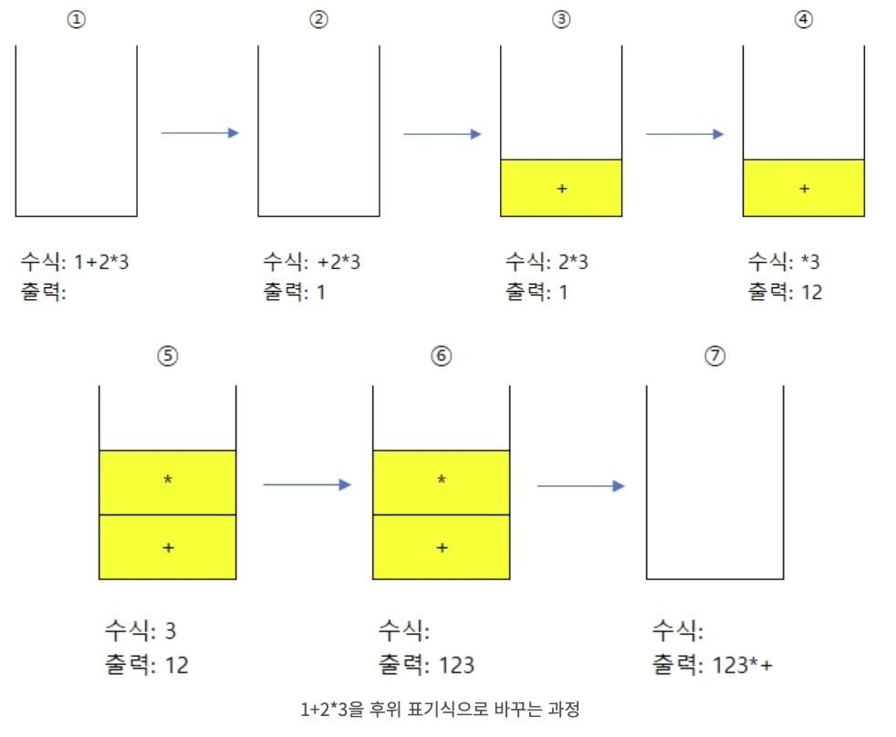

# 문제 (골드2)

수식은 일반적으로 3가지 표기법으로 표현할 수 있다. 연산자가 피연산자 가운데 위치하는 중위 표기법(일반적으로 우리가 쓰는 방법이다), 연산자가 피연산자 앞에 위치하는 전위 표기법(prefix notation), 연산자가 피연산자 뒤에 위치하는 후위 표기법(postfix notation)이 그것이다. 예를 들어 중위 표기법으로 표현된 a+b는 전위 표기법으로는 +ab이고, 후위 표기법으로는 ab+가 된다.

이 문제에서 우리가 다룰 표기법은 후위 표기법이다. 후위 표기법은 위에서 말한 법과 같이 연산자가 피연산자 뒤에 위치하는 방법이다. 이 방법의 장점은 다음과 같다. 우리가 흔히 쓰는 중위 표기식 같은 경우에는 덧셈과 곱셈의 우선순위에 차이가 있어 왼쪽부터 차례로 계산할 수 없지만 후위 표기식을 사용하면 순서를 적절히 조절하여 순서를 정해줄 수 있다. 또한 같은 방법으로 괄호 등도 필요 없게 된다. 예를 들어 a+b*c를 후위 표기식으로 바꾸면 abc*+가 된다.

중위 표기식을 후위 표기식으로 바꾸는 방법을 간단히 설명하면 이렇다. 우선 주어진 중위 표기식을 연산자의 우선순위에 따라 괄호로 묶어준다. 그런 다음에 괄호 안의 연산자를 괄호의 오른쪽으로 옮겨주면 된다.

예를 들어 a+b*c는 (a+(b*c))의 식과 같게 된다. 그 다음에 안에 있는 괄호의 연산자 *를 괄호 밖으로 꺼내게 되면 (a+bc*)가 된다. 마지막으로 또 +를 괄호의 오른쪽으로 고치면 abc*+가 되게 된다.

다른 예를 들어 그림으로 표현하면 A+B*C-D/E를 완전하게 괄호로 묶고 연산자를 이동시킬 장소를 표시하면 다음과 같이 된다.


결과: ABC*+DE/-

이러한 사실을 알고 **중위 표기식이 주어졌을 때 후위 표기식으로 고치는 프로그램을 작성**하시오

# 입력

첫째 줄에 중위 표기식이 주어진다. 단 이 수식의 피연산자는 알파벳 대문자로 이루어지며 수식에서 한 번씩만 등장한다. 그리고 -A+B와 같이 -가 가장 앞에 오거나 AB와 같이 *가 생략되는 등의 수식은 주어지지 않는다. 표기식은 알파벳 대문자와 +, -, *, /, (, )로만 이루어져 있으며, 길이는 100을 넘지 않는다. 

# 출력

첫째 줄에 후위 표기식으로 바뀐 식을 출력하시오

# 예제 입력

```
A*(B+C)
```

```
A+B
```

# 예제 출력 

```
ABC+*
```

```
AB+
```

# 중위 표기식을 후위 표기식으로 바꾸는 방법

1. 괄호가 없는 경우 

- 숫자는 그대로 출력한다
- 만약 스택이 비어있다면 연산자를 스택에 넣는다
- 스택의 top에 있는 연산자의 우선순위보다 현재 연산자의 우선순위가 높으면, 현재 연산자를 스택에 넣는다
- 우선순위가 더 낮으면, 2번 혹은 3번 상황이 될 때까지 pop하여 출력하고 연산자를 스택에 넣는다 
- 모든 수식을 다 사용했다면 스택이 빌 때까지 pop하여 출력한다 
- 우선순위는 (더하기=빼기) < (곱하기=나누기)이다



① 1+2라는 중위 표기 식이 준비되었다.
② [규칙 1]에 의해 '1'은 숫자니까 그대로 출력한다.
③ [규칙 2]에 의해 스택이 비어있으므로(= 비교할 연산자가 없으므로) '+'를 스택에 추가한다.
④ [규칙 1]에 의해 '2'는 숫자니까 그대로 출력한다.
⑤ [규칙 5]에 의해 스택에 남아있는 '+'를 pop 하여 출력한다.



① 1+2*3이라는 중위 표기식이 준비되었다.
② [규칙 1]에 의해 '1'은 숫자니까 그대로 출력한다.
③ [규칙 2]에 의해 스택이 비어있으므로(= 비교할 연산자가 없으므로) '+'를 스택에 추가한다.
④ [규칙 1]에 의해 '2'는 숫자니까 그대로 출력한다.
⑤ [규칙 3]에 의해 '+'보다 '*'의 우선순위가 크므로 '*'를 스택에 추가한다.
⑥ [규칙 1]에 의해 '3'은 숫자니까 그대로 출력한다.
⑦ [규칙 5]에 의해 스택의 모든 연산자를 pop 해서 순서대로 출력한다.

2. 괄호가 있는 경우 

- 여는 괄호는 스택에 그냥 추가한다 
- 여는 괄호 다음에 오는 연산자는 그냥 스택에 추가한다 
- 닫는 괄호는 여는 괄호가 나올 때까지 스택을 pop하여 출력한다. 다 출력하고 난 뒤 괄호들은 버린다 

# 참고한 사이트

[https://todaycode.tistory.com/73](https://todaycode.tistory.com/73)